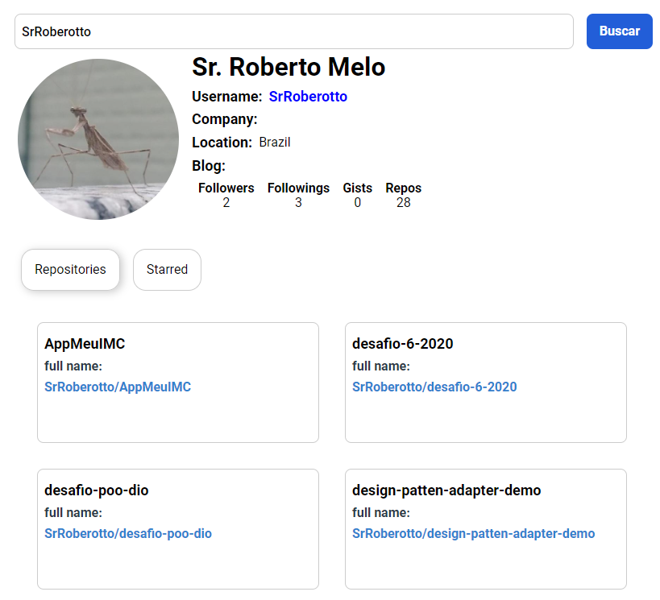

# Sobre o projeto

Este repositório foi criado para mostrar como podemos criar uma aplicação frontend com componentes reutilizáveis.

Vamos criar um aplicativo usando a API pública do github.

Projeto funcionando: [Github API Interface](https://github-api-interface-theta.vercel.app/)

## Funções

- [x] Pesquisar informações pelo nome de usuário
- [x] Pesquisar repositórios pelo nome de usuário
- [x] Pesquisar repositórios que o usuário marcou com estrela pelo nome de usuário

## Preview

## Bibliotecas utilizadas

- [axios](https://www.npmjs.com/package/axios)
- [react-tabs](https://www.npmjs.com/package/react-tabs)
- [styled-components](https://styled-components.com/)

